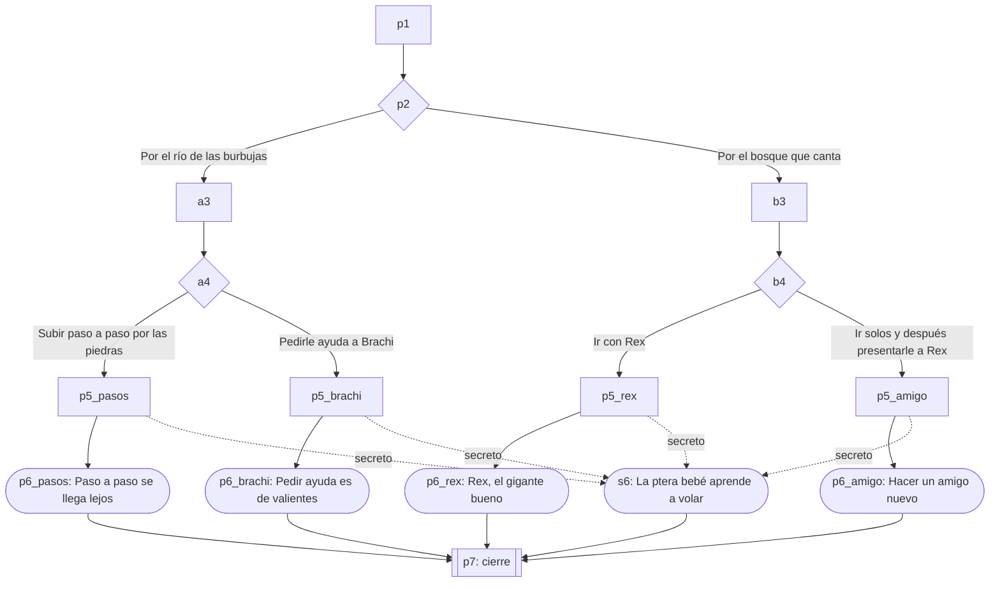

# Árbol de "El huevo que brillaba"

Generado por `tools/validate.py`. No editar a mano.

Final secreto: con las marcas huella_1, huella_2, huella_3 se va a `s6`.

```mermaid
flowchart TD
  p1[p1]
  p2{p2}
  a3[a3]
  a4{a4}
  b3[b3]
  b4{b4}
  p5_pasos[p5_pasos]
  p5_brachi[p5_brachi]
  p5_rex[p5_rex]
  p5_amigo[p5_amigo]
  p6_pasos(["p6_pasos: Paso a paso se llega lejos"])
  p6_brachi(["p6_brachi: Pedir ayuda es de valientes"])
  p6_rex(["p6_rex: Rex, el gigante bueno"])
  p6_amigo(["p6_amigo: Hacer un amigo nuevo"])
  s6(["s6: La ptera bebé aprende a volar"])
  p7[["p7: cierre"]]
p1 --> p2
p2 -->|"Por el río de las burbujas"| a3
p2 -->|"Por el bosque que canta"| b3
a3 --> a4
a4 -->|"Subir paso a paso por las piedras"| p5_pasos
a4 -->|"Pedirle ayuda a Brachi"| p5_brachi
b3 --> b4
b4 -->|"Ir con Rex"| p5_rex
b4 -->|"Ir solos y después presentarle a Rex"| p5_amigo
p5_pasos --> p6_pasos
p5_pasos -.->|secreto| s6
p5_brachi --> p6_brachi
p5_brachi -.->|secreto| s6
p5_rex --> p6_rex
p5_rex -.->|secreto| s6
p5_amigo --> p6_amigo
p5_amigo -.->|secreto| s6
p6_pasos --> p7
p6_brachi --> p7
p6_rex --> p7
p6_amigo --> p7
s6 --> p7
```
